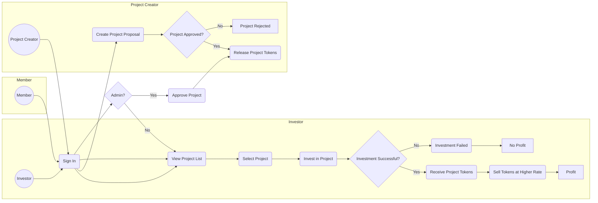
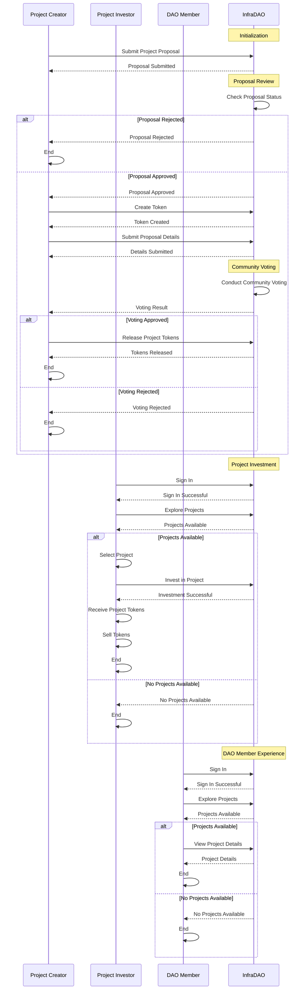

# InfraDAO

InfraDAO is a Web3 Infrastructure DAO built on the Hedera blockchain network. It provides a decentralized funding platform for projects, allowing them to receive financial support from the community. The DAO operates through a voting mechanism, where projects are proposed, voted on, and approved by the community. Once a project is approved, project tokens are released to community members who have staked specific amounts on the project.

## Theme of Submission

### Problem Addressed

InfraDAO aims to address the funding challenges faced by projects in the target industry/community. Many projects struggle to secure adequate funding through traditional centralized financial institutions, hindering their growth and potential impact. InfraDAO provides a decentralized alternative, enabling projects to access funding from a community of stakeholders.

### Target Industry and Pain Points Addressed

InfraDAO targets a wide range of industries and communities that can benefit from decentralized funding. It addresses the pain points of:

1. Lack of Accessible Funding: Many projects, especially those in emerging markets or with unconventional ideas, face difficulties in accessing traditional funding sources. InfraDAO opens up new avenues for funding by leveraging the power of decentralized finance.

2. Centralized Control and Bias: Traditional funding sources are often centralized, leading to potential biases and limited transparency in decision-making. InfraDAO promotes decentralized governance, giving the community a voice in determining which projects receive funding.

## Issue Identified for Submission

The issue identified for submission is the lack of inclusive and community-driven funding mechanisms for projects in various industries. InfraDAO aims to provide a platform where projects can seek support from the community and receive funding based on democratic voting.

## Design 

## Thought Process behind the Project

The team behind InfraDAO believes that by leveraging Web3 technologies and the Hedera blockchain network, they can empower projects and communities to overcome traditional funding limitations. The thought process behind the project includes:

1. Empowering the Community: InfraDAO enables the community to participate in the decision-making process, allowing them to have a direct impact on the projects they believe in. By decentralizing funding, the project aims to create a more inclusive and transparent ecosystem.

2. Leveraging Web3 Infrastructure: Web3 technologies provide the necessary tools for decentralized governance and secure financial transactions. InfraDAO utilizes these technologies to ensure the integrity and efficiency of the funding process.

3. Enhancing Project Success: By aligning project funding with community interests, InfraDAO aims to increase the likelihood of project success. Community members who have a stake in the projects are more likely to contribute their expertise, connections, and resources to support the projects' growth.

## Future Plans for the Project

The team has ambitious plans for the future development and expansion of InfraDAO. Some of the key future plans include:

1. Scaling and Adoption: The project intends to scale its infrastructure and attract a larger user base. This will enable a more diverse range of projects to benefit from decentralized funding and foster a vibrant ecosystem.

2. Partnerships and Collaborations: InfraDAO aims to forge partnerships and collaborations with other blockchain projects, communities, and industry stakeholders. This will foster synergies, expand the reach of InfraDAO, and create opportunities for cross-platform collaborations.

3. Continuous Improvement: The team is committed to actively seeking feedback from the community and incorporating improvements based on their input. Regular updates and enhancements to the platform will ensure a seamless and user-friendly experience for both project owners and community members.

## License

This project is licensed under the [MIT License](LICENSE). Feel free to use, modify, and distribute the code for personal or commercial purposes.
